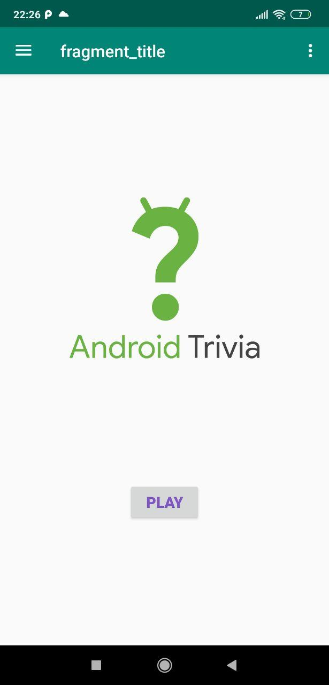
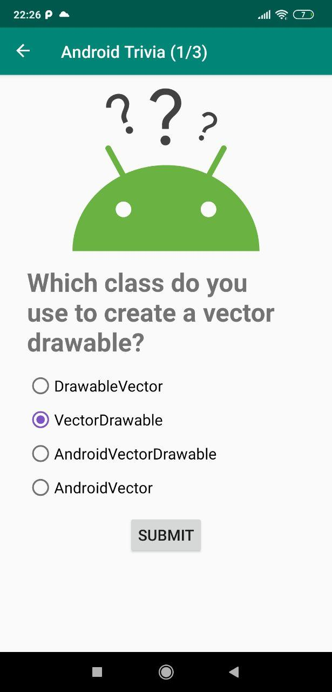
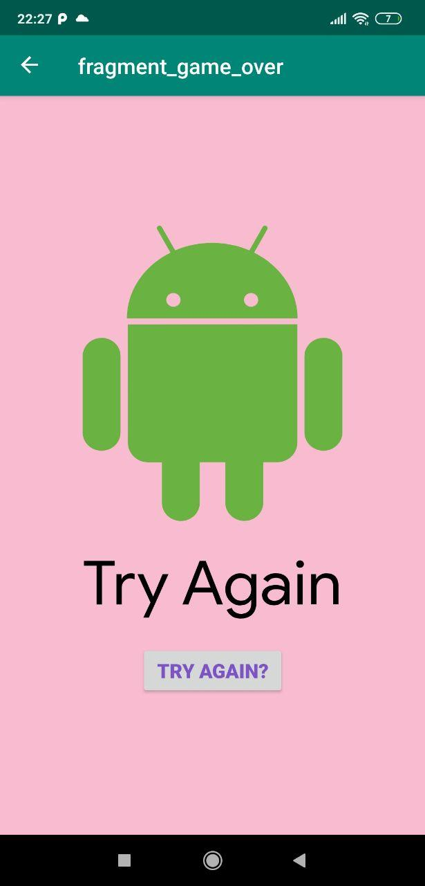
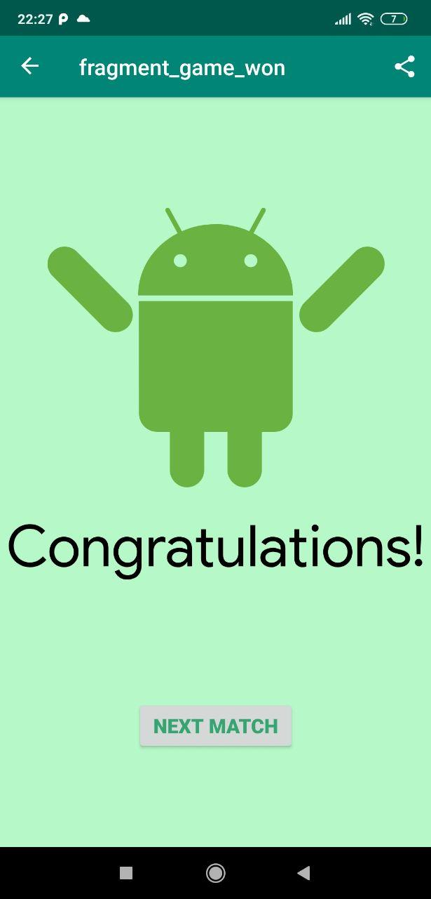

AndroidTrivia
============================

Based on the starter code for Android Kotlin Fundamentals codelab 3.1: Create and add a
fragment.

Introduction
------------

The AndroidTrivia app asks the user trivia questions about Android development.
It makes use of the navigation component within Jetpack to move the user between
screens. Each screen is implemented as a fragment.

The app navigates using buttons, the app bar, and a navigation drawer.
 
 Screenshots
 
 
 
 
 
 
